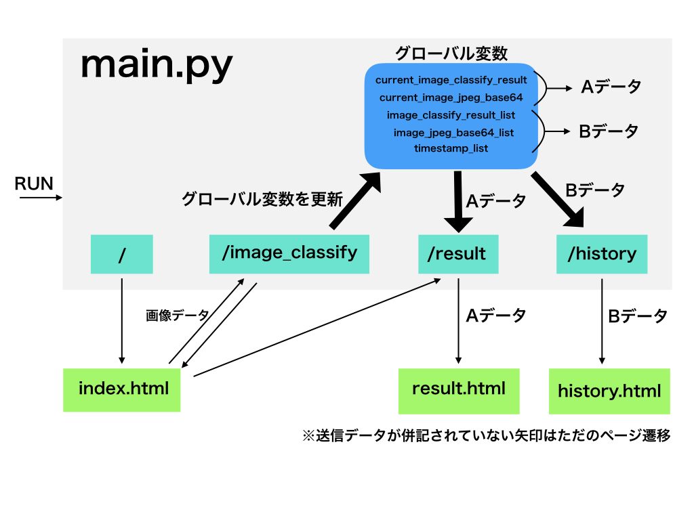

# Video-Image-Classifier
Recognition of captured images of movies using web cameras

## 環境
* Python 3.5.2
* Flask 0.12.2
* Keras 2.1.5
* numpy 1.14.2
* Pillow 5.0.0
* tensorflow 1.6.0

## 実行フロー
実行するときは
```
python main.py
```
を実行し，デプロイ先が
(i)ローカルの場合
```
localhost:8080
```
(ii)リモートの場合
```
(グローバルIP):8080
```
にアクセス（ポート番号はコード内で変更可）
